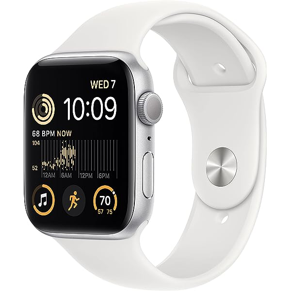

The Apple Watch integrates hardware, software, and the user interface. The Watch connected to
the user’s iPhone can be used for telephone calls, messages, directions, payments, fitness
tracking, medical monitoring, etc. A full computer system on a single custom chip powers the
Watch. The Watch features WiFi 802.11b/g, Bluetooth 4.0 and Near Field Communication
(NFC) for communicating with iPhone. NFC enables the user to make payments in stores which
use touch payment features. A certain device account number particularly made for each credit
card is used instead of the user’s credit card numbers. A passcode is needed to use Apple Pay for
payments. The Watch can obtain location information with the user’s iPhone GPS [1].

Apple Watch can perform several of the same security checks that iOS and iPadOS can do such
as performing a secure restart and software updates. Updating watchOS is important because it
can keep malware viruses from entering the user’s device and it can help speed up the system
and run efficiently. When wrist detection is turned on, the device automatically locks after taken
off of the user’s wrist. When wrist detection is off, the user can open the Control Center to lock
the Watch. When the lock is off, Apple Pay can be used only by unlocking the Watch with the
passcode. The Watch can be used by being connected with only one iPhone at one time. When
the Watch is not connected with an iPhone, iPhone will show directions about how to delete
everything from the Watch. In order to connect the Watch with iPhone, the Watch shows a
special image that can be captured with the iPhone camera. That image has an encoded secret for
Bluetooth Low Energy (BLE) out-of-band pairing [2].

In the US, more parents are buying Apple Watch for their children. Parents can use it to track
their child’s location with the watch’s cellular capabilities. Creating an Apple ID for their child is
necessary to operate the Watch. After reviewing Apple’s parent privacy disclosure, parents need
to input their child’s personal data [3].

To support patients, healthcare systems are extensively using Watch applications such as activity
trackers, heart rate monitors, calorie burns, and fall detection. Apple Watches are useful for
medical staff to communicate with each other and quickly prepare for medical emergencies using
real-time medical data of patients [4].

One of the security goals for the Watch is to present users with accurate data by preventing
hackers from modifying it. It is important for healthcare systems to know accurate medical data
of patients for making treatment plans. People who exercise would benefit from using a Watch as
a reliable fitness tracker. Another security goal is to protect the users’ private information and
personal data input into the Watch in order not to expose their life to danger.

Although Apple does a decent job for protecting privacy and security of the users, there are some
possible threats. An Apple Watch should be connected to an iPhone for GPS, wireless
connections and application downloads. A hacker of the Watch could steal private information
from the iPhone. A criminal could steal the credit card information from Apple Pay on the
iPhone using the Watch to make payments with NFC. A criminal could also connect a Watch
and someone’s iPhone and steal private information. There are vulnerabilities using Wi-Fi and
Bluetooth. The location of the Watch could be tracked using data.

There are some disadvantages as well. Apple Watch can collect and process information fast,
which can cause privacy and security issues. It has a built-in voice assistant and can track your
information with the commands that you give. This can be a privacy concern because they can
create a profile for you. When a Watch is used in public, there is a risk to your privacy when Siri
responds to you. The Watch has a built-in rechargeable lithium-ion battery which lasts 18 hours.
While it is worn on the user’s wrist for a long time, it can collect and process the user’s private
information. It is inconvenient that the Apple Watch is compatible with only iPhone. The use of
third-party watch applications is allowed for the Watch through the App Store, but they could
steal the user’s data [3].

For the potential threats, the following defenses are considered. Users should update their
applications regularly, disable applications to access to their personal information, and not allow
companies to track their data and turn that into an advertisement. A strong passcode should also
be created. Just in case the Watch is stolen, it can be set so that it will delete all of the user’s data
after someone tries to unlock it ten times. Users can turn off Location Services if they are
worried about its security. They can also use “fine-tune” location permissions so that they can
give permission to only the applications they trust. Users can set the watch to hide the contents of
their notifications until they tap on the alert or hide sensitive complications such as heart rate,
appointments, and messages when their wrist is not raised [5].

Currently there are more than 100 million Watch users in the world. Since 2015 when it was first
released, the number of users has been increasing rapidly. This proves its high reliability [6].
Even though there are possible threats and weaknesses, if the users are careful with the safety of
applications, the passcode and settings, they can prevent those risks to a large degree. Apple has
created eight prior designs and will be releasing the Series 9 next September. I believe it will
continue evolving more in the future to enhance security and privacy.

Image: https://miro.medium.com/v2/resize:fit:1200/1*VTW6T-7KkQHPjf4mtfQ0Zg.png](https://images-na.ssl-images-amazon.com/images/I/71RAk7Bn2ZL._AC_UL600_SR600,600_.jpg

References

1. Johnson, B. (2015, January 14). How the Apple Watch Works. HowStuffWorks. Retrieved

October 31, 2022, from https://electronics.howstuffworks.com/gadgets/high-tech-
gadgets/apple-watch.htm

2. Apple Inc. (2022, May 13). System security for watchOS. Apple Platform Security. Retrieved

October 31, 2022, from https://support.apple.com/guide/security/system-security-for-
watchos-secc7d85209d/web

3. Kelly, G. (2020, April 24). Learn about the Apple Watch privacy and security features.
Common Sense Education. Retrieved October 31, 2022, from

https://www.commonsense.org/education/articles/privacy-and-security-evaluation-of-the-
apple-watch

4. 42Gears Mobility Systems Pvt Ltd. (2019, May 27). Business uses of Apple Watches. 42Gears .

Retrieved October 31, 2022, from https://www.42gears.com/blog/business-uses-of-apple-
watches/

5. SecureMac. (2022, January 14). 5 Apple Watch Security and Privacy Tips. SecureMac.

Retrieved October 31, 2022, from https://www.securemac.com/news/5-apple-watch-
security-and-privacy-tips

6. Laricchia, F. (2022, April 29). Global Apple watch users/installed base 2015-2020. Statista.

Retrieved October 31, 2022, from https://www.statista.com/statistics/1221051/apple-
watch-users-worldwide/

