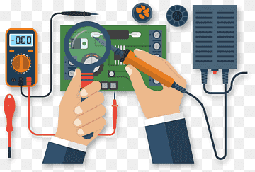

As someone who was always interested in computers and technology, I decided to major in Computer Engineering upon arriving at UH Manoa in 2017. However, after taking my first course in C (EE160), I did not enjoy any part of programming nor did I understand any of it at that time. I talked with my advisor, and he asked me several times if I was sure. I thought it was a good choice, so I made the switch to Electrical Engineering.

Fast forward a few years and I’m now pursuing a Master’s Degree. My interests have now gone further away from Electrical Engineering to more towards the IT field. I decided to work with one of my favorite professors and do my final project on Apple iCloud Relay. After I successfully completed that and graduated, I took a position in Downtown Honolulu as an electrical engineer. It was different from what I had expected to do and made me realize that I should have stuck with Computer Engineering in the first place.

Because I had a Bachelor’s and Master’s Degree in Electrical Engineering under my belt, I wondered if I could use those credits towards something in Computer Science. After consulting with an advisor at the ICS department at UH Manoa, I decided that the best thing for me to do is to pursue another Master’s Degree in Computer Science and build a strong foundation and the skills needed to thrive in a high-tech company in the future. I knew that I needed to put in the work to get up to speed with the rest of the students. This summer, I took ICS 111, 141, 211, and 241. Yes, it wasn’t easy, but you gotta do what you have to do. 

While I didn’t know what to expect from the ICS department, I am happy to say that I am actually learning some software development skills. I probably should have gone this direction a while ago, but at least I got to experience the world of Electrical Engineering.

Even though I may not have the background or the obsession of video games that I find most students have, I plan to build a strong foundation in programming and software development in this class. Additionally, I would love to create a few connections with my classmates and professors that could lead to more opportunities in the workforce. 

Image: https://w1.pngwing.com/pngs/301/571/png-transparent-engineering-electricity-electrical-engineering-maintenance-electronic-component-electronic-engineering-multimeter-electrical-network-thumbnail.png
