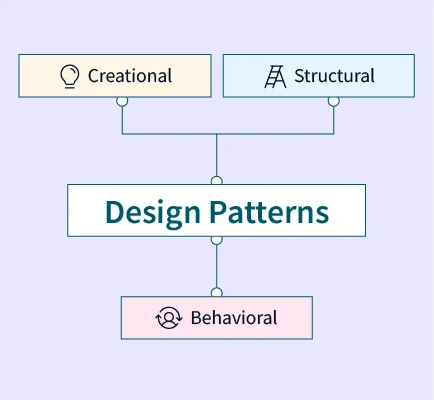
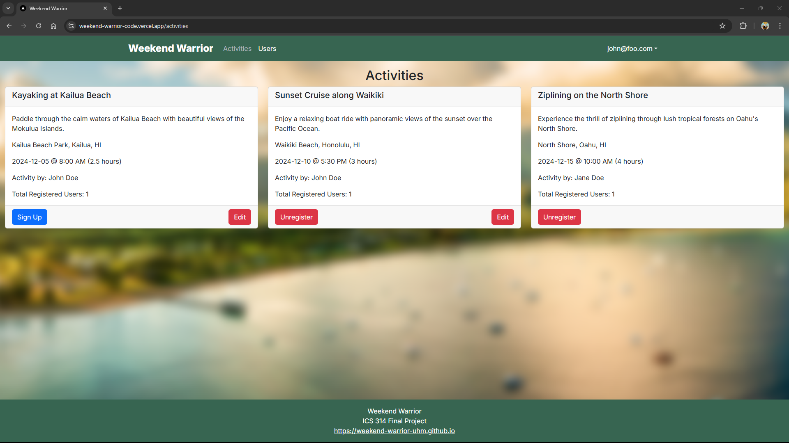

Imagine you’re in charge of designing a city. At first glance, everything is a mess. Then, as the city grows, patterns start to appear - street grids, park layouts, and large buildings. This is where design patterns come into play.

Source: https://dusp.mit.edu/sites/default/files/styles/large/public/slider-images/entwine.png?itok=FhV85Hgk

## What are design patterns?

A design pattern is a general, reusable solution of how to solve a common problem when you’re designing an application. They are like blueprints for building things. They save time because someone already figured out the best way to solve the problem - we simply use them in our own project.

There are several different types of design patterns: Creational, Structural, and Behavioral.

    

Source: https://www.scaler.com/topics/images/design-pattern-in-software-engineering_thumbnail.webp

## Seeing it in Action

Weekend Warrior is the website our team made for the final project for my Software Development class. It was designed for fellow college students and locals to easily find similar interests and activities for the weekend. 

### Singleton (One instance of something)
The Singleton pattern acts as the application’s database, making sure there’s only one source of data collection. When someone registers for an account or activity, their information gets inputted into the database. Having multiple database, 

### Observer (click to sign up - activities)
When a user clicks on the “sign up” button, the selected activity gets updated and shows the number of users who are registered for that given activity.
