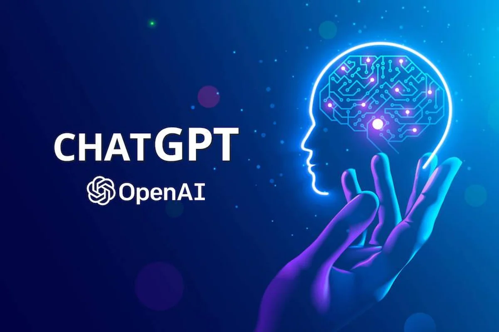

## I. Introduction
Without a doubt, Artificial Intelligence (AI) has changed the way we interact with technology. Whether it be ChatGPT, Gemini, Meta, Perplexity, or even NotebookLM, we now have access to a variety of tools for our curiosity.
The recent development of Generative AI is truly remarkable. I can remember the early stages of ChatGPT. People, including me, were all curious about what this thing was. As OpenAI started to work on the tool and roll some of its features out to the public, I thought it was pretty interesting and had the potential to turn it into something we would eventually all use. Little did I know that I would use AI pretty much every single day.

## II. Personal Experience with AI:
In this section, I will talk about my personal experiences with AI technologies within ICS 314 (Software Engineering).

##### 1. Experience WODs e.g. E18
For the Experience WODs, I mostly used the provided video tutorial. If I had any trouble, I would ask Google or put my question on the class Discord.

##### 2. In-class Practice WODs
These were practice for the graded WODs, so I did not use AI. I asked my table mates if I ran into any problems.

##### 3. In-class WODs
Because these were timed, I felt a lot of pressure to get the correct answer. Instead of using AI and explaining the entire problem from scratch, I found that looking at a similar example was a much better use of time. 

##### 4. Essays
The use of AI for an essay seems like you’re not using your own voice. However, I had Google find synonyms for me.

##### 5. Final project
Since the final project was such a large portion of our grade, I used ChatGPT because I felt the need to get the best answer in the shortest amount of time to meet the Milestone deadlines.

##### 6. Learning a concept / tutorial
I found myself using YouTube or other online resources, such as W3Schools, to learn concepts.

##### 7. Answering a question in class or in Discord
I did not need to use any AI to answer a question in class or in Discord, as I already knew the answer beforehand.

##### 8. Asking or answering a smart-question
Similar answer as above. I did not find any reason to ask an AI for asking or answering a smart-question.

##### 9. Coding example e.g. “give an example of using Underscore .pluck”
ChatGPT was great at giving me coding examples. If I had a question about any part of my code, it would provide me with a solution and a useful example as well.

##### 10. Explaining code
I did not have any situations where I needed to explain code, so I did not use AI.

##### 11. Writing code
There were a few times when I did not know how to even start the problem. I had ChatGPT help me understand the code then.

##### 12. Documenting code
No AI was used for any documentation. However, I did write down some concepts on Google Docs that I thought were needed for later reference.

##### 13. Quality assurance
There were some instances where the code just wasn’t cooperating with me, so I asked ChatGPT or GitHub Copilot. It was very useful in explaining why it wasn’t working.

##### 14. Other uses in ICS 314 not listed
All uses were listed.

## III. Impact on Learning and Understanding:
I would say that AI has definitely enhanced my understanding of software engineering concepts. There have been many times when it has given me useful examples and explanations, which allowed me to fully comprehend the concepts. I believe my skills have developed a lot over the course of this class as a result.

## IV. Practical Applications:
I made English listening practice videos using AI for my part-time job. My task was to create a video for beginner learners. I used DALL-E for the images and ElevenLabs for the narration. The finished product was a lot better than I thought it would be. It turns out that AI can be very helpful with projects outside of the classroom.

## V. Challenges and Opportunities:
There were a few times when AI wouldn’t understand my question until I explained exactly what I wanted. I would have liked to have it “see” my screen or be integrated within my computer. GitHub Copilot is a tool that I wish I would have learned about sooner in the course. It is very good at assisting you inside of Visual Studio Code.

## VI. Comparative Analysis:
A mix of both traditional teaching methods and AI-enhanced approaches would work for the future of education. Even though AI will eventually take over software engineering education, I still strongly believe in the power of humans teaching other humans. If AI completely takes over, then our knowledge retention and engagement will be a major concern. At the end of the day, humans like to connect with fellow humans, not robots.

## VII. Future Considerations:
Looking at the future of AI can be a scary topic to some. As far as software engineering education is concerned, AI will continue to advance so much that there will be no point in not using it when teaching.

## VIII. Conclusion:
In conclusion, I did not find AI to be a nuisance for this Software Engineering course. In fact, I think it was very helpful and found that ChatGPT was the best tool for code. If used well, AI can be a great tool for both teaching and learning. Future students will need to adapt to new technologies and use AI to their advantage. 

