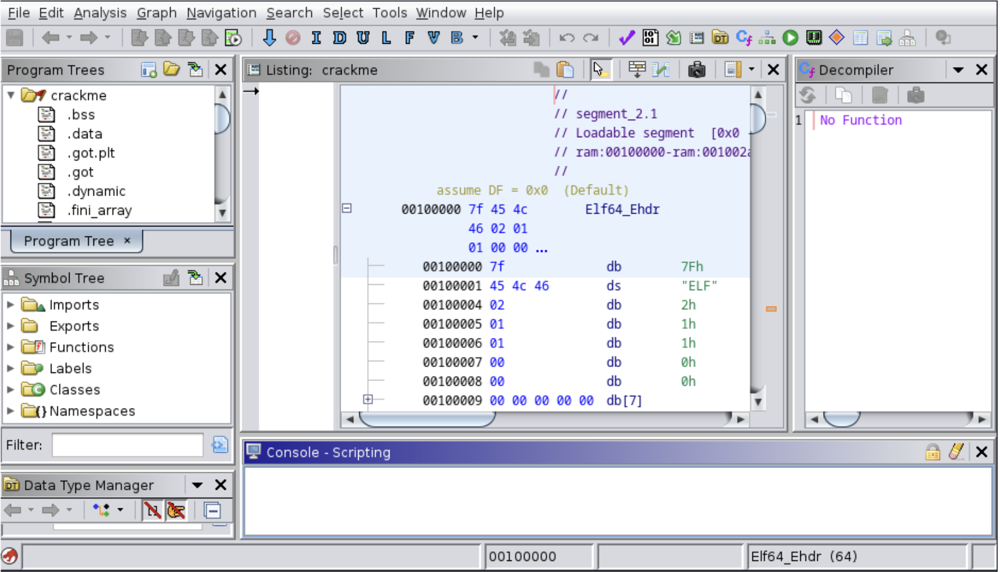

## Introduction

In a world of cybersecurity where attacker and Cybersecurity professionals plays cats and mouse all day, reverse engineering comes in play for the Cybersecurity engineer to understand how a program works and dissect it to find out potential vulnerabilities or weaknesses that can be exploited. Cybersecurity engineer often use reverse engineering techniques to examine malware, viruses, and other malicious program to understand their behavior.
In this paper we talked about the Motivation for Reverse Engineering and some real life experience that successfully helped to secure out system from cyber threats. Then we talked about what is Software Reverse Engineering and Software Forward Engineering, some tools that industry uses day to day and some techniques. And we concluded our paper with a conclusion.

## Ghidra
  
Ghidra is a free open-source reverse engineering software that has been developed by the National Security Agency (NSA) for over two decades. It became available to the public in March 2019 with the main objective of establishing a community of devoted and knowledgeable users who could solve complex cybersecurity issues. The Ghidra development team recognized the significance of cybersecurity skills and the need to train more people in this field. Ghidra was created as a platform for developing and
studying next-generation technologies, and it is continuously adapting to tackle new cybersecurity threats as new devices are introduced. The Ghidra team has collaborated with Morgan State University to utilize Ghidra for the purpose of detecting and reducing potential security threats associated with linking contemporary cars to wireless technologies such as Bluetooth, Wi-Fi, and cellular networks. 
(https://www.nsa.gov/Press-Room/News-Highlights/Article/Article/2958453/cybersecurity-speaker-series-ghidra-beyond-the-code/)

Ghidra is an open-source tool that offers a wide range of features, such as disassembling, assembling, and decompiling. It can be installed on numerous workstations at no cost and is compatible with various operating systems such as Windows, Linux, and Mac, as well as different processor families including SPARC, PowerPC, and Intel. One of Ghidra’s applications is its ability to help engineers circumvent the methods utilized by hackers to hide the operations of malicious software. A common example is when attackers insert a small program that decrypts or decompresses the real program kept in a data format. This technique enables attackers to bypass anti-malware defenses. By using Ghidra, engineers can develop tools that can decrypt or decompress the data and analyze the actual code. Ghidra also has a feature that facilitates the comparison of compilers. Compilers are responsible for translating source code into object code, which comprises numerical values that direct the processor on which function to execute. Since every compiler has its own method of performing this translation, analyzing how different compilers handle the same source code can assist engineers in evaluating their effectiveness. Ghidra supports engineers in this process by examining both the assembly language and the decompiled program. In addition, Ghidra is valuable in enhancing extensive programming projects. For example, the graphical representation of function relationships displays the interaction between different functions in the program. Improving the efficiency of the frequently used function can lead to enhancement of the overall performance of the program. If unused subroutines or functions are detected, the best way to approach this problem should be determined based on the information gathered. 
(https://www.rangeforce.com/blog/learn-reverse-engineering-with-ghidra-the-free-tool-built-by-the-nsa)

One significant advantage of the Ghidra is its ability to decompile the object code into source code, which eliminates the need to read the assembly language. Another advantage is that Ghidra can operate in headless mode, which enables large-scale reverse engineering by running multiple instances of the tool on the cloud. This mode, along with Ghidra’s repository-sharing ca- pabilities, allows different teams to collaborate and examine large binary files together. Furthermore, software engineers have the option to utilize scripting languages to customize Ghidra according to their specific needs, expanding its functionality beyond that of a simple disassembler. Groups can utilize the available API to develop additional features and scripts. The undo/redo function is widely used because it enables users to test the behavior of the analyzed code and undo their actions if their approach does not produce the desired results. Ghidra also provides contextual help menus and an easy-to-use interface that allows users without extensive experience in reverse engineering to modify, combine, and rebuild binary files. 
(https://www.rangeforce.com/blog/learn-reverse-engineering-with-ghidra-the-free-tool-built-by-the-nsa)

Ghidra is written in Java, which tends to consume a significant amount of memory. This could potentially cause problems when working with very large files, as the memory usage may become excessive and slow down the performance of the tool. (https://www.techtarget.com/searchsecurity/news/252459574/Despite-reservations-about-NSAs-Ghidra-experts-see-value) 

Although the tool’s source code is available, adding support for new architectures and resolving bugs can be time-consuming. Compared to IDA Pro, Ghidra has a more limited range of supported architectures and file loaders, and its debugger integration is not as comprehensive.The performance of the disassembler is slow, particularly when processing large files over 150MB. Therefore, Ghidra may not fully substitute IDA Pro at its present stage. The official website for Ghidra, which is ghidra-sre.org, allows users to download the software. However, users from certain countries outside the US, such as Canada, may not be able to access the website. (https://hackmag.com/security/nsa-ghidra/)

## How to do Reverse Engineering using Ghidra
                                                                                                                                                                                                                                                                                                                                                                                                                                                                                                                                                                                                                                                   
To install Ghidra, simply install the Java Development Kit (JDK) 17 64-bit, download a Ghidra release file, and run the included executable. After starting Ghidra, you will see the project window.
                                                                                                                                                                                                                                                                                                                                                                                                                                                                                                                                                                                                                                                   
Create a new project by clicking File > New Project. You will then be asked whether you want to create a “non-shared project” or a “shared project”. Non-shared projects are the typical use-case where only one person is able to view or edit the project. In comparison, a shared project allows multiple users to view and edit files by implementing a version control protocol similar to Git. For our purposes, we will be using a non-shared project. Select the non-shared project option and click ‘Next’. Select the destination to save your project and the name of your project, then finish the creation process.
                                                                                                                                                                                                                                                                                                                                                                                                                                                                                                                                                                                                                                                   
You can import files by clicking File > Import File. Click on the folder that your desired file is in. Then select the file you want to import.                                                                                                                                                                                                                                                                                                                                                                                                                                                                                                                                                                                                                                                

We can analyze files by importing a file into our project. Once the file is imported, a prompt will appear asking whether or not we want Ghidra to analyze the file. We will select “Yes”. Another window will show the different analysis options we have. Select the desired option and click Analyze. Once Ghidra has finished analyzing, it is now our turn to start reverse engineering the file.                                                                                                                                                                                                                                                                                                                                                                                                                                                                                                                                                                                                                                                   
