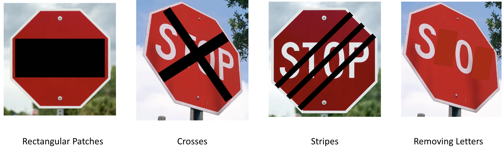
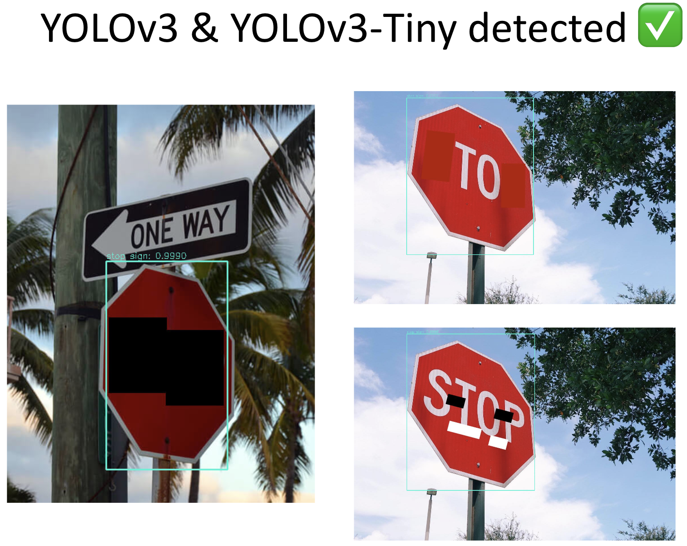
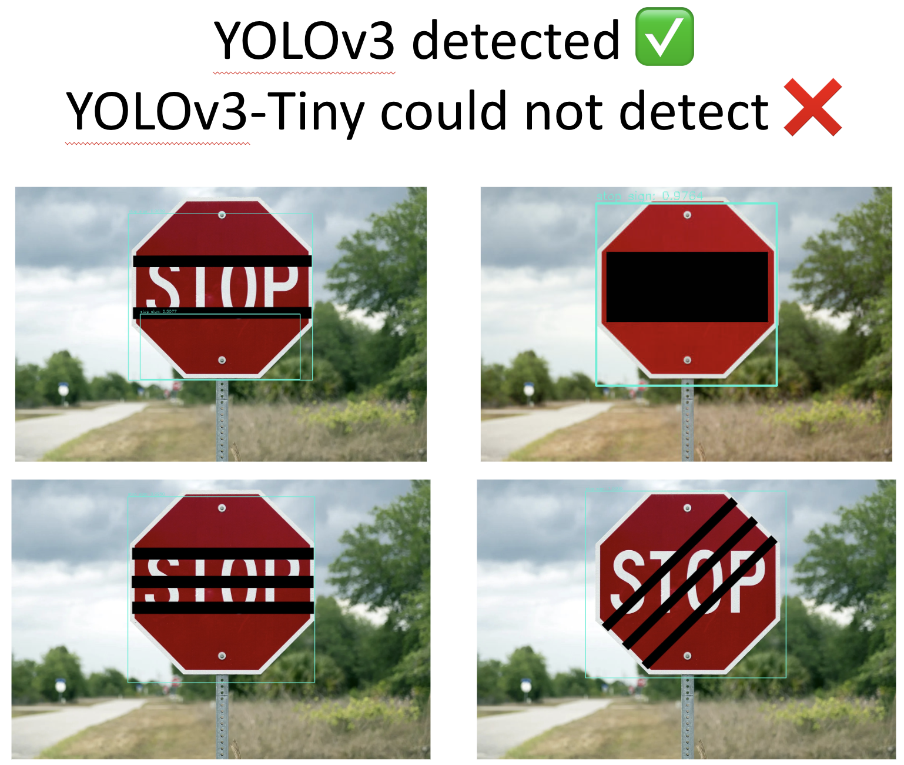
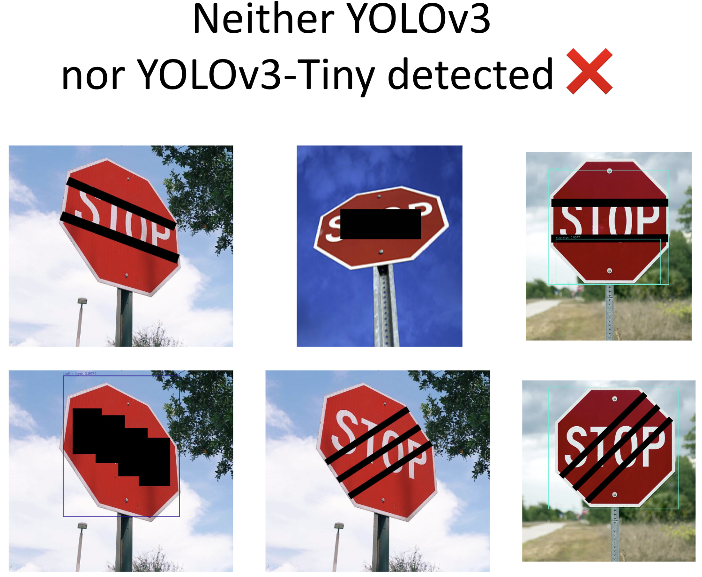

# Abtract
Object detection is a computer vision method to classify and locate objects in an image. Object detection methods can be divided into machine learning methods and deep learning methods. 
Object detection models are based on Deep-learning neural networks (DNNs) which are excellent for identifying the differences by using shapes and color, but DNNs are vulnerable to adversarial attacks such as
adversarial patch attacks (APAs) and small alterations on an image. It is important to improve the security of AI systems and to explore effective solutions against adversarial attacks. 
Understanding how attacks and defenses work on object detection models will help develop better object detection for future applications. To evaluate the vulnerability of YOLO v3 and YOLO v3-Tiny against adversarial patch attacks, we created diverse variations of stop signs with black,
red and white rectangular patches covering different parts of the sign and ran the images through the YOLOv3 and YOLOv3-Tiny model. As a result, it was found that covering up the letters with stripes was the best type of attack in our test cases. The models were able to detect the stop sign even with the letter completely
blocked.

# Introduction
Object detection is a computer vision method to detect objects in an image, locate the detected objects by drawing boxes around them, and label those objects. Object detection is different from image recognition which only labels a class of an object or image segmentation which divides an image into multiple groups of pixels because object detection locates and labels objects in an image.

Object detection methods can be divided into machine learning methods and deep learning methods. Machine learning methods analyze different features of an image to detect sets of pixels of an object and input those features into a regression model and predict the location and label of the object. Deep learning methods, which are the state-of-the-art techniques, do not need to analyze features of an image. They use convolutional neural networks (CNNs) to achieve an end-to-end object detection.
Deep learning-based object detection models consist of two components: an encoder and a decoder. An encoder receives an image as input, passes it through a sequence of blocks and layers and derives analytical features for locating and labeling objects. A decoder which receives the outputs of the encoder draws bounding boxes around the objects and gives labels to those objects. The most basic decoder, the regressor, detects the x, y coordinate and height and width of bounding boxes from the output of the encoder. To use the regressor, it is necessary to identify how many objects should be detected beforehand.
The region proposal network is more accurate and flexible than the regressor. In this model, regions which might include objects are proposed. Random numbers of regions can be proposed. The pixels of the proposed regions are sent to a classification subnetwork, and then a label will be given to the object, (or the proposal will be denied). Next, the pixels of the proposed regions will go through a classification network.
Single shot detectors (SSDs) use a group of predefined regions which are anchor boxes in an image. The anchor boxes have differ- ent shapes and sizes as regions. This model predicts if an object is inside the anchor box or not and adjusts the location and size of the anchor box to fit the object correctly. Since there are overlaps among the outputs of SSDs, a post-processing method to filter the anchor boxes and select the best box is needed. Non-maximum suppression is the most common post-processing algorithm for choosing the best box out of multiple overlapping anchor boxes.
To evaluate how accurate the output of the object detector is, intersection-over-union (IOU) is generally used. When there are two bounding boxes, the area of the intersection of those boxes is divided by the area of the union of those boxes. The IOU value 0 shows no overlap and 1 shows perfect overlap.

# YOLO Model
YOLO stands for “You Only Look Once.” It was created by Joseph Redmon, et al in 2015. Although the R-CNN model might work more precisely, the YOLO model is a much faster real-time object detection model. The YOLO model can process images at 45 frames
per second. A faster version of the YOLO model can run at 155 frames per sec. The YOLO model is end-to-end object detection model. An image is taken as input and divided into SxS grid cells. If the center of an object is inside a grid cell, the grid cell is in charge of detecting the object. Each bounding box is composed of x, y coordinates (center of the box), width, height, and confidence score. Each grid cell also predicts the class probabilities.

# Implementation of YOLOv3
YOLOv3 was the model used to implement object detection. The model was implemented in python3 using OpenCV for image capture. The model was pre-trained using the Common Objects in Context (COCO) dataset. The model can accept images or videos to process and output the respective media with bounding boxes with the name of the object and the confidence value over objects. The focus of this project revolved around detecting stop signs through APAs.
Two models, YOLOv3 and YOLOv3-Tiny, were used to detect stop signs with APAs. The difference between YOLOv3 and YOLOv3- Tiny is that YOLOv3-Tiny trades off accuracy for speed. Both models
were trained with the COCO dataset. The YOLOv3 model could detect stop signs even when objects obstruct the sign. One of the images sent through the model has an APA appended to it, the model was able to detect the stop sign, but it also detected people when the image did not have people in it. On an M1 Macbook Air, while plugged in, the YOLOv3 model computes each frame an average of 0.35 seconds, giving around two frames per second or two fps. There are multiple versions of YOLOv3 that were tested. With YOLOv3-Tiny, real-time detection is possible. Using the same laptop configuration, the YOLOv3-Tiny model processes about 0.035 seconds per frame or around 27.2 fps.

# Attack Model
To evaluate how vulnerable YOLOv3 and YOLOv3-Tiny are against adversarial patch attacks, we applied diverse patches onto the stop sign. We created different stop signs with rectangular patches using white, red and black colors. Based on the variety of attacks, patches covering up most of the letters tend to deceive the OD models. However, more than covering the letters is needed to trick the models fully. When the stop sign is perfectly flat in the image, covering up the letters was not able to trick YOLOv3, but it was able to trick YOLOv3-Tiny (4b); when attacks are applied to stop signs that were at an angle, that is when the OD models struggle to detect the stop sign. In (1c) and (4c), the letters “STOP” are clearly visible but neither model could detect the stop sign. In (3c), YOLOv3 detected the stop sign as a traffic light (89%). I assume it misidentified the stop sign as a 4-color traffic light. It is interesting that YOLOv3 detected two stop signs in (3b). The larger box was 97%, and the smaller box was 50%. Two signs were detected in (3b) with two lines, but in (6b) with three lines only one stop sign was detected.

# Defense
A potential defense against these shape attacks is applying another layer of object recognition and color detection. Our target is a stop sign with an octagon shape and red with white text. The attacks applied consisted of blocking out the white text on the stop sign; if the background is masked out, the shape of the sign can easily be recognized. Another layer is to add color recognition to the object recognition. If the masked shape has a grouping of red pixels, a red-shaped octagon is highly likely to be a stop sign. With this approach, the text of the stop sign is not considered.

  

# Conclusion
We compared two object detection models, YOLOv3 and YOLOv3-Tiny, against stop signs. Comparing a set of attacks on the two models shows what attacks work best. The attacks we used consisted of obscuring the letters on the stop sign with lines, pluses, and crosses across the stop sign and applying the same attacks to stop signs taken at two different angles. We found that obscuring the letters with stripes with an angled stop sign was the best type of attack in our test cases. When the attacks were applied to a stop sign normal to the image, YOLOv3 was able to detect the sign through all of the attacks.
