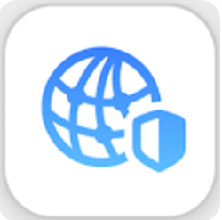
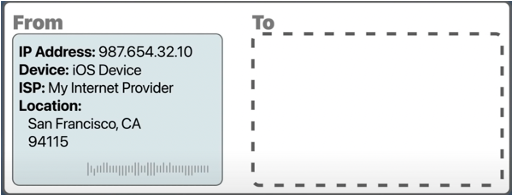
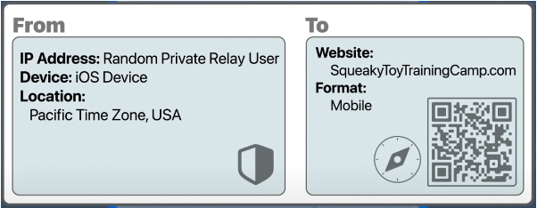
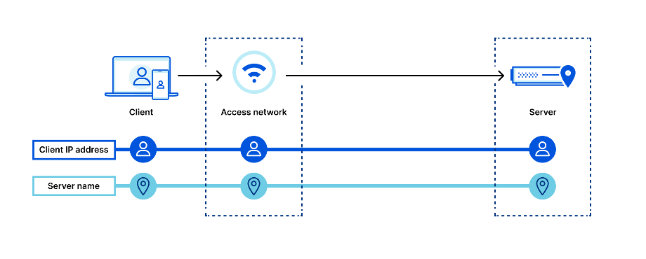
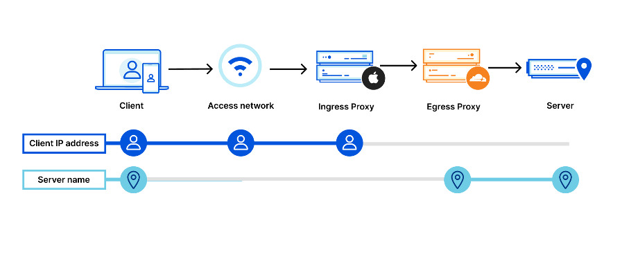

iCloud Private Relay is included with an iCloud+ subscription. Apple offers 50GB for $0.99, 200GB for $2.99, and 2TB for $9.99. It is available on iOS 15, iPadOS 15, and macOS Monterey.
Private Relay helps prevent networks and websites from collecting information about your browsing activity in Safari and it helps protect unencrypted app usage.

Why should we use Private Relay?
  - When connecting to the Internet, you might use networks such as your home or the local coffee shop

Without Private Relay, networks and websites can see your IP address
  - It can identify what devices you are using, where you are, and what sites you visit
  - It is possible to make a digital profile of your location and browsing activity

Private Relay provides a more private way to browse by separating this information. It uses an innovative internet relay system that acts as a connector between your device and the website you visit.
Your IP address and browsing activity are separated between two different relays.

  - 1st relay: knows IP address (not website information)
    
    
  - 2nd relay: knows where you are going (not your IP address)
    
    

And assigns new Private Relay IP address that shows your general location.
So, your identity cannot be combined with your browsing activity. Your privacy is protected.

< Without Private Relay >
 

< With Private Relay and Cloudflare >
 

By adding two "relays", connection metadata is split:
The user’s original IP address is visible to the access network (e.g. the coffee shop you’re sitting in, or your home ISP) and the first relay (operated by Apple), but the server or website name is encrypted and not visible to either. The first relay gives the encrypted data to a second relay (for example, Cloudflare), but it can’t see “inside” the traffic to Cloudflare.
Cloudflare-operated relays know only that it is receiving traffic from a Private Relay user, but not specifically who or their client IP address. Cloudflare relays then forward traffic on to the destination server.
Splitting connections in this way prevents websites from seeing user IP addresses and minimizes how much information entities “on path” can collect user behavior.

As mentioned, Cloudflare functions as a second relay in the iCloud Private Relay system. Cloudflare operates one of the largest, fastest networks in the world. Their infrastructure makes sure that traffic reaches every network in the world quickly and reliably, no matter where in the world a user is connecting from. They are also great at building and working with modern encryption and transport protocols, including TLS 1.3 and QUIC. QUIC, and closely related MASQUE, are the technologies that enable Private Relay to efficiently move data between multiple relay hops without incurring performance penalties.

The same basic components that control Cloudflare products were used to build support for Private Relay: our network, 1.1.1.1, Cloudflare Workers, and software like quiche, the open-source QUIC (and now MASQUE) protocol handling library, which now includes proxy support.

So, how do you turn it on??

Open the Settings app on your Apple device. Tap on your name. Tap iCloud. Tap Private Relay. Tap the switch to turn it on.
In Safari, Private Relay is designed to be always on and completely transparent, protecting your browsing without any visible difference. 
You can now browse the web with Safari with more privacy and security.
