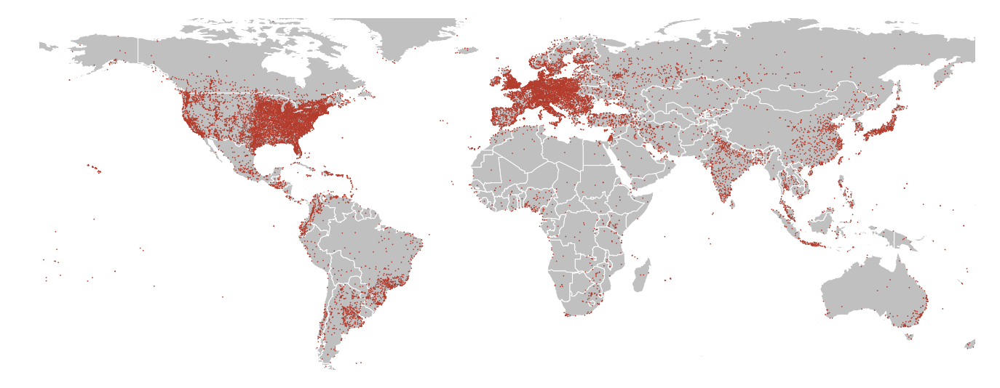
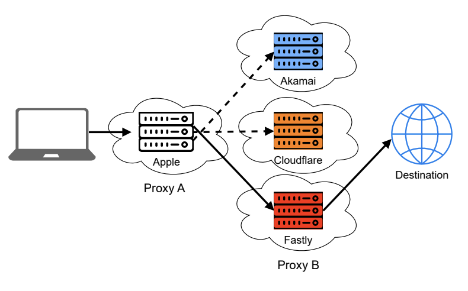
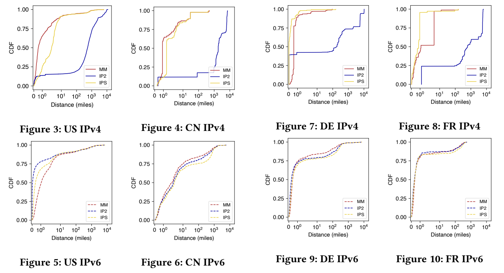
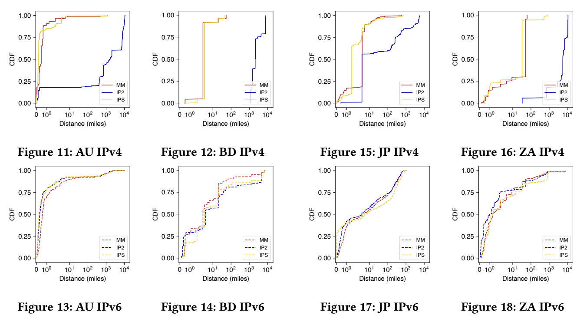

< Advertised Apple iCloud Private Relay egress locations (red) >

Online activities leave behind traces that can violate privacy. Existing systems like Transport Layer Security (TLS) and Virtual Private Networks (VPNs) have limitations in protecting user privacy, and anonymity
networks that use the Decoupling Principle can also face privacy concerns due to potential attacks like traffic analysis. Modern systems aim to achieve privacy while maintaining performance. Apple’s iCloud Private
Relay (PR) utilizes a multi-party relay structure to enhance security and reduce network latency, offering better protection than VPNs. 

Internet Protocol (IP) geolocation is fundamental to how the internet functions today. PR adversely affects the capability of IP geolocation services to accurately determine the physical location of clients. This study examines the accuracy of IP geolocation services with regard to PR by comparing their location data with Apple’s data and analyzing the errors globally and by country for IPv4 and IPv6 addresses. Our analysis of geolocation data for eight selected countries shows that the median error for IP geolocation services can differ by up to 1,000 miles for IPv4 addresses. In fact in some cases, services geolocate IPs to entirely different countries. This work highlights the potential downfalls of privacy-preserving infrastructure based on masking user IP addresses using public cloud infrastructure.

PR aims to ensure the privacy of its users by routing their internet traffic through an ingress and an egress node. This system makes it difficult for eavesdroppers such as Internet service providers (ISPs) to see which
servers the user is communicating with. PR is much easier to access than other privacy protection methods such as VPNs, Proxies, and Tor. The use of PR is available to all Apple device users who have a subscription to
iCloud+. Apple has incorporated PR into its operating systems such as iOS, iPadOS, and macOS.

This service is specifically designed to provide protection to online activity that is not secured through encryption, such as Hypertext Transfer Protocol (HTTP) traffic, DNS queries, and connections established via
Safari, Apple’s web browser. It is impossible for any network operator to directly view the addresses of both the client and server. PR is created as a two-layered relay architecture. The iOS or MacOS devices estab-
lish a connection with an ingress relay to verify their identity and determine their location. Using this data, the clients start a proxy link to the egress relay via the ingress. The egress relay then establishes the con
nection to the intended server. The ingress relays are managed by Apple itself, but the egress relays are managed by Content Delivery Network (CDN) providers such as Akamai, Cloudflare, and Fastly.

Proxy A is an ingress proxy. Proxy B is an egress proxy. This design ensures privacy protection by separating the users’ IP address from the servers they access. Proxy A has access only to the client’s IP address and cannot examine the internet traffic that is encrypted and tunneled. On the other hand, Proxy B can identify the servers that the client accesses, but it does not have access to the IP address of the client. In the same way, the client’s IP address is not visible to the server that the client is connecting to because the connections are established by Proxy B.

The egress layer has the ability to establish the connection and apply other methods to minimize the delay, such as utilizing Transmission Control Protocol (TCP) fast open. For example, Cloudflare utilizes a technology
called Argo. Argo is a virtual network infrastructure that examines and enhances routing choices, leading to better network performance. These strategies of the CDN egress providers help to mitigate any po
tential delay issues caused by the two-hop relay system. 

The PR design follows standard web protocols instead of creating its own. The default protocol for communication with an ingress proxy is Quick User Datagram
Protocol (UDP) Internet Connections (QUIC), but if there are problems with QUIC, HTTP/2 and TLS will be used instead. When communicating with an egress proxy, HTTP/3 and Multiplexed Application Substate
over QUIC Encryption (MASQUE) are used to create fast QUIC connections through a QUIC proxy. If HTTP/3 is not available, the traditional HTTP CONNECT protocol over TLS is used for communication with the egress proxy. 

*IP Geolocation services.* We use three popular IP geolocation services to compare computed locations based on IP address versus the published ground truth dataset.
The services we use are MaxMind GeoIP2 City, IP2Location LITE, and ipstack. Each of the services outputs the geographic coordinates associated with an IP at the city level. Web services commonly use
geolocation services to tailor (or often restrict) content based on a user location. 

*Geographic error.* For each IP address, we calculate the distance between the ground truth coordinates and
the geolocated coordinates from each service, allowing us to reason about how web services would localize users connecting from PR egresses, and whether those locations match locations from which Apple intends
them to appear. 

*Limitations.* Our study is necessarily limited to the IP geolocation services that we have selected. Certainly, other geolocation services may perform better or worse compared with those studied. As this study is meant to shine an initial light on potential web localization issues that could arise from privacy-preserving system architectures, we leave in-depth, service-by-service exploration for future work.

We evaluated the accuracy of geolocation data for both IPv4 and IPv6 in eight chosen countries: Australia (AU), Bangladesh (BD), China (CN), France (FR), Germany (DE), Japan (JP), South Africa (ZA), and the United
States (US). The graphs (Figures 3-18) display the results for both IPv4 and IPv6 of each country. The jagged lines are due to the limited number of data points and IP addresses, while the smoother lines result from a
higher number of data points and IP addresses. Our findings are based on a comparison of the data from these eight countries. 

In MaxMind geolocation data for IPv4, the highest accuracy is found in Germany and Australia, where approximately 85% of the data has errors within a mile. In contrast, South Africa has the lowest accuracy, with only 25% of the data having errors of less than 10 miles. For IPv6, the accuracy is highest in France, where nearly 80% of the data contains errors within a mile. Germany and Australia exhibit moderate accuracy, with roughly 75% of their data having errors within a mile. On the other hand, Bangladesh’s data shows the lowest accuracy, with only about 25% of the data having errors of less than a mile and about 10% of the data containing errors of more than 1,000 miles. 

IP2Location’s IPv4 data is most accurate in Japan, with around 60% of data containing errors within 10 miles, while South Africa has the lowest accuracy, with about 80% of data containing errors of more than 1,000 miles. IP2Location’s IPv6 data is most accurate in the US, with approximately 50% of the data containing almost no errors. However, in Bangladesh, the IPv6 data has the lowest accuracy, with only about 30% of the data having errors of less than a mile and about 20% of the data containing errors of more than 1,000 miles. 

ipstack’s IPv4 data is most accurate in Germany, with around 50% of data containing almost no errors. On the other hand, the accuracy for IPv4 in South Africa is the lowest, with only about 25% of the data having errors within 10 miles. For IPv6 data, France has the highest accuracy, with around 80% of the data having errors within a mile. In contrast, Bangladesh has the lowest accuracy for IPv6 data, with only about 20% of the data having errors within a mile and about 15% of the data containing error of more than 1,000 miles.

In Australia and Germany, MaxMind and ipstack provide highly accurate data for IPv4 and all geolocation data for IPv6 is moderately accurate, but their IP2Location’s IPv4 data has lower accuracy. In France,
ipstack data for IPv4 is highly accurate, and all geolocation data for IPv6 is moderately accurate, but IP2Location’s data for IPv4 has low accuracy. In Japan, all data for IPv4 is moderately accurate, but all data for
IPv6 is less accurate. In China, all geolocation data for IPv6 has relatively low accuracy. For IPv4, its data from MaxMind and ipstack show similar, relatively high accuracy, but both have a noticeable drop in accuracy between about a mile and fifty miles. Also, IP2Location’s IPv4 data has low accuracy in China. In Bangladesh, IPv4 data for Maxmind and ipstack are moderately accurate, but IP2Location’s IPv4 data begins with a minimum distance of 1,000 miles, which is because there are no egress points located within that range. Also, IPv6 data for all geolocation services has the lowest accuracy in Bangladesh. In the US, IPv6 data for all geolocation
services and IPv4 data for MaxMind has relatively high accuracy, but IP2Location’s IPv4 data has low accuracy. In South Africa, all geolocation data for IPv4 has the lowest accuracy. Its IP2Location data for IPv4 begins
with a minimum distance of 50 miles because there are no egress points located within that range. All geolocation data for IPv6 has relatively low accuracy in South Africa. 

The results indicate that the accuracy of IP geolocation data for PR egress IP addresses varies significantly depending on the country, geolocation services, and
IP version (IPv4 or IPv6). In all examined countries, there is a similar accuracy level among all geolocation services for IPv6. However, for IPv4, in most of the countries, MaxMind and ipstack have similar accuracy
levels, but IP2Location’s data has the lowest accuracy. Overall, MaxMind and ipstack seem to provide more accurate data than IP2Location. Countries with a limited number of data points or IP addresses available,
such as Bangladesh and South Africa, show lower accuracy in geolocation data. Internet infrastructure in these countries may not be fully developed, and there maybe fewer ISPs available compared to other countries.
On the other hand, countries with a higher number of data points or IP addresses available, such as Australia and Germany, display higher accuracy levels in geolocation data. Those countries are likely to have highly
developed internet infrastructures and more ISPs.

These findings indicate that PR has significant effects on the accuracy of IP geolocation services. While PR is effective in protecting a user’s location privacy, it
also makes it harder for IP geolocation services to accurately determine a user’s location. This creates difficulties for businesses, governments, and researchers
who depend on IP geolocation services for their work. Further research is necessary to improve the accuracy of IP geolocation services while ensuring user’s privacy
and security. 

The ultimate goal is to achieve localization in a privacy-preserving manner, but the question that still remains is how to localize clients using privacy-
preserving protocols. We leave such systems study to future work.
