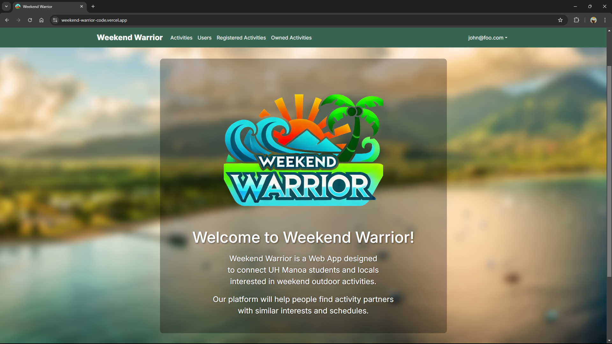

## Overview
Many UH Manoa students and locals have a hard time finding people with similar interests to join them in outdoor activities and hobbies. Whether it’s hiking, beach outings, surfing, or just hanging out, it’s not always easy to find partners or groups that align with specific plans or schedules.

Weekend Warrior is a platform that allows users to post their upcoming weekend plans or desired activities and connect with others interested in joining them. This app would serve as a local meetup spot for casual and activity-based connections. It will also make it easier to find activity buddies and plan for fun weekends.

## Project Goals

- Users can create or find activities to join.
- Admins ensure content safety and platform use.

## Group Contract
Click <a href="https://docs.google.com/document/d/11WCz0wKi_EQwpVjwTQwwox7MkSHgHivBXGg_-en4Drg/edit?usp=sharing">here</a> to view our group contract.

## Meet The Team

  <!-- First Person -->
  

    <h2>Nigel Arias</h2>
    

      Contact info:  
       - Email: narias8@hawaii.edu 
      <a href="https://nwarias003.github.io/">Portfolio</a>
    

  

  <!-- Second Person -->
  

    <h2>Sean Flynn</h2>
    

      Contact info:  
       - Email: sflynn7@hawaii.edu 
      <a href="https://seanhflynn.github.io/">Portfolio</a>
    

  

  <!-- Third Person -->
  

    <h2>Min Jun Han</h2>
    

      Contact info:  
       - Email: minjun@hawaii.edu 
      <a href="https://min-808.github.io/">Portfolio</a>
    

  

  <!-- Fourth Person -->
  

    <h2>Mhar Olipani</h2>
    

      Contact info:  
       - Email: mhar@hawaii.edu 
      <a href="https://mharolipani.github.io/">Portfolio</a>
    

  

